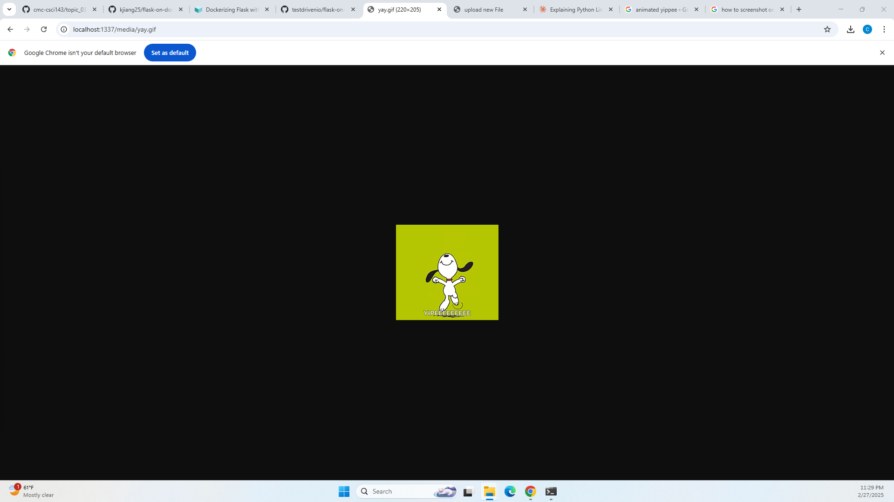

# Instagram Tech Stack by Dockerizing Flask with Postgres, Gunicorn, and Nginx

## Description 
This project uses Docker, Flask, Postgres, Gunicorn, and Nginx to create a "mini instagram". Users can upload an image to a postgres database, which other users can access. The image is first sent through Nginx, which is a load balancer that handles traffic and directs to a WSGI server, which is Gunicorn in this case. Gunicorn then sends the image to our database in Postgres. For users accessing the image, the same flow is done in reverse.  

## In Use
**Uploading**


**Viewing**


**Gif Uploaded**


## Build Instructions

1. To run, first ensure that docker is installed on your machine. Ensure docker has access to the web and install flask. 
2. To build the production docker image, run 
```
$ docker compose -f docker-compose.prod.yml up -d --build
$ docker compose -f docker-compose.prod.yml exec web python manage.py create_db
```
3. Upload an image at http://localhost:8080/upload.
4. View the image at http://localhost:8080/media/IMAGE_FILE_NAME.

Note: To access localhost:8080, you may have to port forward to port 1069 first.

